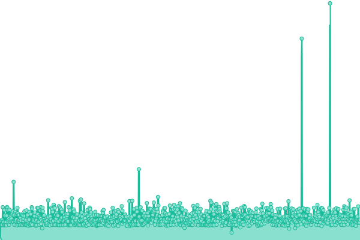

# [📈 Live Status](https://GeoportalIGM-ec.github.io/NTRIP-monitor): <!--live status--> **🟥 Complete outage**

This repository contains the open-source uptime monitor and status page for [Geoportal IGM Ecuador](http://www.geoportaligm.gob.ec), powered by [Upptime](https://github.com/upptime/upptime).

With [Upptime](https://upptime.js.org), you can get your own unlimited and free uptime monitor and status page, powered entirely by a GitHub repository. We use [Issues](https://github.com/GeoportalIGM-ec/NTRIP-monitor/issues) as incident reports, [Actions](https://github.com/GeoportalIGM-ec/NTRIP-monitor/actions) as uptime monitors, and [Pages](https://GeoportalIGM-ec.github.io/NTRIP-monitor) for the status page.

<!--start: status pages-->
<!-- This summary is generated by Upptime (https://github.com/upptime/upptime) -->
<!-- Do not edit this manually, your changes will be overwritten -->
<!-- prettier-ignore -->
| URL | Status | History | Response Time | Uptime |
| --- | ------ | ------- | ------------- | ------ |
|  [CASTER NTRIP IGM (Principal)](http://regme-ip.igm.gob.ec:2101) | 🟥 Down | [caster-ntrip-igm-principal.yml](https://github.com/GeoportalIGM-ec/NTRIP-monitor/commits/HEAD/history/caster-ntrip-igm-principal.yml) | 

 0ms
     
 | 

<a href="https://GeoportalIGM-ec.github.io/NTRIP-monitor/history/caster-ntrip-igm-principal">0.00%</a>
    

|  [CASTER NTRIP IGM-ESPOCH (Backup)](http://regme-ip.espoch.edu.ec:2101) | 🟥 Down | [caster-ntrip-igm-espoch-backup.yml](https://github.com/GeoportalIGM-ec/NTRIP-monitor/commits/HEAD/history/caster-ntrip-igm-espoch-backup.yml) | 

 0ms
     
 | 

<a href="https://GeoportalIGM-ec.github.io/NTRIP-monitor/history/caster-ntrip-igm-espoch-backup">0.00%</a>
    

<!--end: status pages-->

[**Visit our status website →**](https://GeoportalIGM-ec.github.io/NTRIP-monitor)

## 📄 License

- Powered by: [Upptime](https://github.com/upptime/upptime)
- Code: [MIT](./LICENSE) © [Geoportal IGM Ecuador](http://www.geoportaligm.gob.ec)
- Data in the `./history` directory: [Open Database License](https://opendatacommons.org/licenses/odbl/1-0/)
